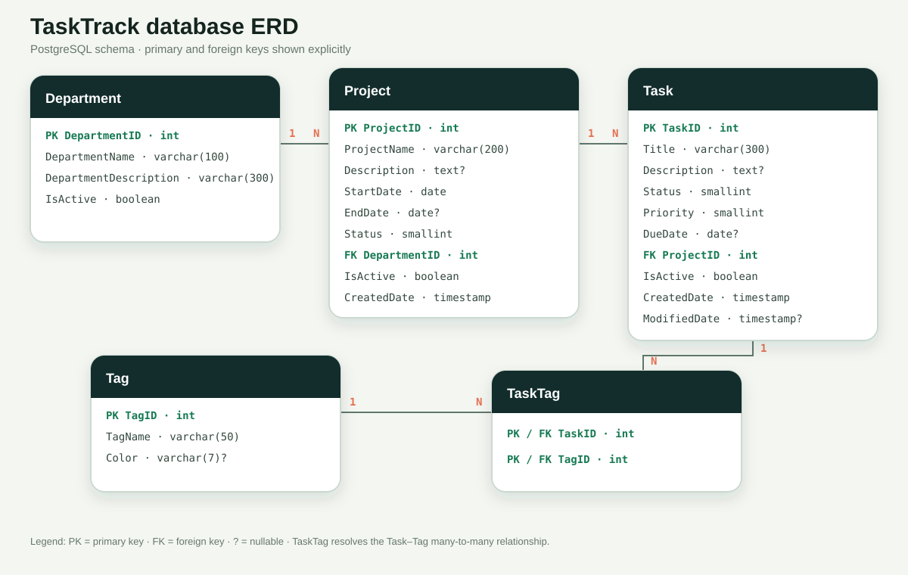

# TaskTrack API

ASP.NET Core 8 API for the PRN232 Task Management assignment.

## Run locally

Store the local PostgreSQL connection outside Git, then run the API:

```powershell
dotnet user-secrets set --project TaskTrack.API "ConnectionStrings:DefaultConnection" "Host=localhost;Port=5432;Database=qe190064_prn232_ass1;Username=postgres;Password=YOUR_PASSWORD"
dotnet run --project TaskTrack.API
```

On Render, set `DATABASE_URL`, `CORS_ORIGINS` to the frontend URL, and
`ASPNETCORE_ENVIRONMENT=Production` instead of using User Secrets.

Swagger is available at `/swagger`.

The API exposes public CRUD for departments, projects, tasks, and tags. Tasks use soft-delete; departments, projects, and tags reject deletes while related records exist.

## Entity relationship diagram


